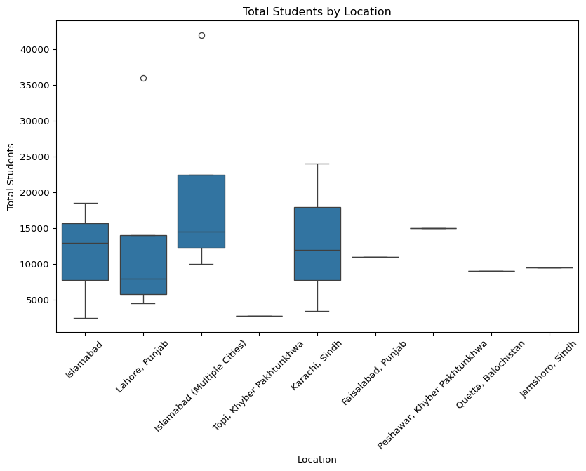
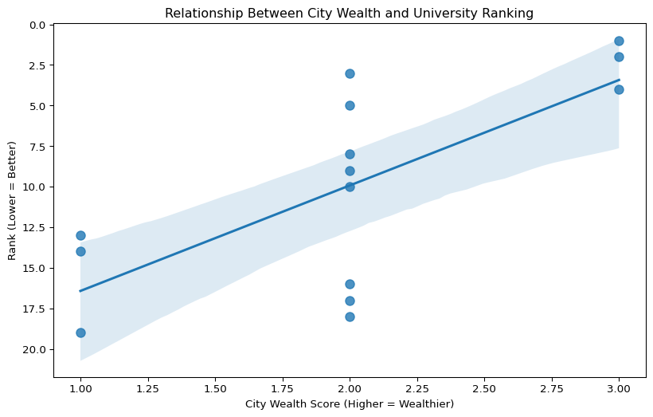

# Social Inequality Pakistans Universities
Julius Mondschein

``` python
import pandas as pd 
import statsmodels.api as sm 
import numpy as np
import matplotlib.pyplot as plt
import statsmodels.formula.api as smf
import seaborn as sns

data = pd.read_csv('Top_20_Pakistani_Universities.csv') 

data.head
```

    <bound method NDFrame.head of     Rank                                    University Name  \
    0      1  National University of Sciences and Technology...   
    1      2                      Quaid-i-Azam University (QAU)   
    2      3    Lahore University of Management Sciences (LUMS)   
    3      4  Pakistan Institute of Engineering and Applied ...   
    4      5                               University of Punjab   
    5      6                 COMSATS University Islamabad (CUI)   
    6      7                 Ghulam Ishaq Khan Institute (GIKI)   
    7      8  University of Engineering and Technology (UET)...   
    8      9                          Aga Khan University (AKU)   
    9     10                              University of Karachi   
    10    11                                  Bahria University   
    11    12                           FAST National University   
    12    13               University of Agriculture Faisalabad   
    13    14                             University of Peshawar   
    14    15                                     Air University   
    15    16                University of Health Sciences (UHS)   
    16    17  University of Veterinary and Animal Sciences (...   
    17    18       NED University of Engineering and Technology   
    18    19                          University of Balochistan   
    19    20    Mehran University of Engineering and Technology   

                            Location  Established Year  Total Students  \
    0                      Islamabad              1991           18500   
    1                      Islamabad              1967           13000   
    2                 Lahore, Punjab              1984            5800   
    3                      Islamabad              2000            2500   
    4                 Lahore, Punjab              1882           36000   
    5    Islamabad (Multiple Cities)              1998           42000   
    6       Topi, Khyber Pakhtunkhwa              1993            2800   
    7                 Lahore, Punjab              1921           14000   
    8                 Karachi, Sindh              1983            3500   
    9                 Karachi, Sindh              1951           24000   
    10   Islamabad (Multiple Cities)              2000           16000   
    11   Islamabad (Multiple Cities)              2000           13000   
    12            Faisalabad, Punjab              1906           11000   
    13  Peshawar, Khyber Pakhtunkhwa              1950           15000   
    14   Islamabad (Multiple Cities)              2002           10000   
    15                Lahore, Punjab              2002            8000   
    16                Lahore, Punjab              2002            4500   
    17                Karachi, Sindh              1922           12000   
    18           Quetta, Balochistan              1970            9000   
    19               Jamshoro, Sindh              1963            9500   

        Number of Campuses                                   Programs Offered  \
    0                    8  Engineering, IT, Medical Sciences, Business, S...   
    1                    1  Natural Sciences, Social Sciences, Biological ...   
    2                    1  Business, Engineering, Law, Economics, Humanit...   
    3                    1  Nuclear Engineering, Electronics, Materials Sc...   
    4                    4  Arts, Sciences, Business, Engineering, IT, Med...   
    5                    7  Computer Science, Engineering, Business, Scien...   
    6                    1  Engineering, Computer Science, Management Scie...   
    7                    4  All Engineering Disciplines, Architecture, Sci...   
    8                    3      Medicine, Nursing, Education, Arts & Sciences   
    9                    2  Arts, Sciences, Business, Pharmacy, Engineerin...   
    10                   4  Engineering, IT, Management, Law, Psychology, ...   
    11                   5  Computer Science, Engineering, Management Scie...   
    12                   4  Agriculture, Veterinary, Engineering, Food Sci...   
    13                   2  Arts, Sciences, Social Sciences, Law, Educatio...   
    14                   5  Engineering, IT, Management, Aeronautics, Avia...   
    15                   1  Medicine, Dentistry, Pharmacy, Nursing, Allied...   
    16                   2  Veterinary Medicine, Animal Sciences, Biotechn...   
    17                   1    Engineering, Architecture, Management, Sciences   
    18                   1       Arts, Sciences, Law, Commerce, Education, IT   
    19                   1  Engineering, Architecture, Management, IT, Sci...   

       University Type  Total Faculty  Campus Area (Acres) QS Ranking (Asia)  
    0           Public            850                 1000                92  
    1           Public            650                 1705           151-160  
    2          Private            325                  100           121-130  
    3           Public            180                  350           201-250  
    4           Public           1800                 1800           251-300  
    5           Public           1500                  450           301-350  
    6          Private            150                  400           301-350  
    7           Public            700                  105           351-400  
    8          Private            450                   85           251-300  
    9           Public           1200                 1279           401-450  
    10          Public            800                  220           451-500  
    11          Public            650                  150           451-500  
    12          Public            850                 2550           501-550  
    13          Public            900                 1026           501-550  
    14          Public            550                  160           551-600  
    15          Public            400                   75           551-600  
    16          Public            350                 1600           601-650  
    17          Public            650                  117           601-650  
    18          Public            450                  300           651-700  
    19          Public            500                  387           651-700  >

``` python
data['City'] = data['Location'].str.split(',').str[0].str.strip()
data['City'].unique()
```

    array(['Islamabad', 'Lahore', 'Islamabad (Multiple Cities)', 'Topi',
           'Karachi', 'Faisalabad', 'Peshawar', 'Quetta', 'Jamshoro'],
          dtype=object)

1.  How does the Ranking of the school correlate with the city they are
    located in

``` python
model = smf.ols('Rank ~ C(Location)', data=data).fit()
print(model.summary())
```

                                OLS Regression Results                            
    ==============================================================================
    Dep. Variable:                   Rank   R-squared:                       0.612
    Model:                            OLS   Adj. R-squared:                  0.330
    Method:                 Least Squares   F-statistic:                     2.167
    Date:                Wed, 03 Dec 2025   Prob (F-statistic):              0.117
    Time:                        10:36:37   Log-Likelihood:                -53.956
    No. Observations:                  20   AIC:                             125.9
    Df Residuals:                      11   BIC:                             134.9
    Df Model:                           8                                         
    Covariance Type:            nonrobust                                         
    ===============================================================================================================
                                                      coef    std err          t      P>|t|      [0.025      0.975]
    ---------------------------------------------------------------------------------------------------------------
    Intercept                                      13.0000      4.844      2.684      0.021       2.338      23.662
    C(Location)[T.Islamabad]                      -10.6667      5.594     -1.907      0.083     -22.978       1.645
    C(Location)[T.Islamabad (Multiple Cities)]     -2.0000      5.416     -0.369      0.719     -13.921       9.921
    C(Location)[T.Jamshoro, Sindh]                  7.0000      6.851      1.022      0.329      -8.078      22.078
    C(Location)[T.Karachi, Sindh]                  -0.6667      5.594     -0.119      0.907     -12.978      11.645
    C(Location)[T.Lahore, Punjab]                  -3.2000      5.307     -0.603      0.559     -14.880       8.480
    C(Location)[T.Peshawar, Khyber Pakhtunkhwa]     1.0000      6.851      0.146      0.887     -14.078      16.078
    C(Location)[T.Quetta, Balochistan]              6.0000      6.851      0.876      0.400      -9.078      21.078
    C(Location)[T.Topi, Khyber Pakhtunkhwa]        -6.0000      6.851     -0.876      0.400     -21.078       9.078
    ==============================================================================
    Omnibus:                        0.409   Durbin-Watson:                   0.975
    Prob(Omnibus):                  0.815   Jarque-Bera (JB):                0.339
    Skew:                           0.275   Prob(JB):                        0.844
    Kurtosis:                       2.678   Cond. No.                         14.9
    ==============================================================================

    Notes:
    [1] Standard Errors assume that the covariance matrix of the errors is correctly specified.

``` python
data['Location'].unique()
```

    array(['Islamabad', 'Lahore, Punjab', 'Islamabad (Multiple Cities)',
           'Topi, Khyber Pakhtunkhwa', 'Karachi, Sindh', 'Faisalabad, Punjab',
           'Peshawar, Khyber Pakhtunkhwa', 'Quetta, Balochistan',
           'Jamshoro, Sindh'], dtype=object)

2.  What does the total student size of each city look like

``` python
model = smf.ols('Q("Total Students") ~ C(Location)', data=data).fit()
print(model.summary())
```

                                 OLS Regression Results                            
    ===============================================================================
    Dep. Variable:     Q("Total Students")   R-squared:                       0.176
    Model:                             OLS   Adj. R-squared:                 -0.424
    Method:                  Least Squares   F-statistic:                    0.2931
    Date:                 Wed, 03 Dec 2025   Prob (F-statistic):              0.954
    Time:                         10:36:37   Log-Likelihood:                -210.78
    No. Observations:                   20   AIC:                             439.6
    Df Residuals:                       11   BIC:                             448.5
    Df Model:                            8                                         
    Covariance Type:             nonrobust                                         
    ===============================================================================================================
                                                      coef    std err          t      P>|t|      [0.025      0.975]
    ---------------------------------------------------------------------------------------------------------------
    Intercept                                      1.1e+04   1.23e+04      0.893      0.391   -1.61e+04    3.81e+04
    C(Location)[T.Islamabad]                      333.3333   1.42e+04      0.023      0.982    -3.1e+04    3.16e+04
    C(Location)[T.Islamabad (Multiple Cities)]   9250.0000   1.38e+04      0.671      0.516   -2.11e+04    3.96e+04
    C(Location)[T.Jamshoro, Sindh]              -1500.0000   1.74e+04     -0.086      0.933   -3.99e+04    3.69e+04
    C(Location)[T.Karachi, Sindh]                2166.6667   1.42e+04      0.152      0.882   -2.91e+04    3.35e+04
    C(Location)[T.Lahore, Punjab]                2660.0000   1.35e+04      0.197      0.847    -2.7e+04    3.24e+04
    C(Location)[T.Peshawar, Khyber Pakhtunkhwa]  4000.0000   1.74e+04      0.230      0.823   -3.44e+04    4.24e+04
    C(Location)[T.Quetta, Balochistan]          -2000.0000   1.74e+04     -0.115      0.911   -4.04e+04    3.64e+04
    C(Location)[T.Topi, Khyber Pakhtunkhwa]     -8200.0000   1.74e+04     -0.471      0.647   -4.66e+04    3.02e+04
    ==============================================================================
    Omnibus:                        7.853   Durbin-Watson:                   1.545
    Prob(Omnibus):                  0.020   Jarque-Bera (JB):                5.444
    Skew:                           1.214   Prob(JB):                       0.0657
    Kurtosis:                       3.802   Cond. No.                         14.9
    ==============================================================================

    Notes:
    [1] Standard Errors assume that the covariance matrix of the errors is correctly specified.

``` python
plt.figure(figsize=(10,6))
sns.boxplot(x='Location', y='Total Students', data=data)
plt.title("Total Students by Location")
plt.xticks(rotation=45)
plt.show()
```



3.  Does Wealthier City, Better University Rank?

``` python
wealth_map = {
    'Islamabad': 3,
    'Lahore': 2,
    'Karachi': 2,
    'Rawalpindi': 2,
    'Faisalabad': 1,
    'Peshawar': 1,
    'Quetta': 1
}

data['WealthScore'] = data['City'].map(wealth_map)
```

``` python
model = smf.ols('Rank ~ WealthScore', data=data).fit()
print(model.summary())
```

                                OLS Regression Results                            
    ==============================================================================
    Dep. Variable:                   Rank   R-squared:                       0.492
    Model:                            OLS   Adj. R-squared:                  0.450
    Method:                 Least Squares   F-statistic:                     11.64
    Date:                Wed, 03 Dec 2025   Prob (F-statistic):            0.00516
    Time:                        10:36:38   Log-Likelihood:                -40.355
    No. Observations:                  14   AIC:                             84.71
    Df Residuals:                      12   BIC:                             85.99
    Df Model:                           1                                         
    Covariance Type:            nonrobust                                         
    ===============================================================================
                      coef    std err          t      P>|t|      [0.025      0.975]
    -------------------------------------------------------------------------------
    Intercept      22.9286      4.010      5.718      0.000      14.192      31.666
    WealthScore    -6.5000      1.906     -3.411      0.005     -10.652      -2.348
    ==============================================================================
    Omnibus:                        1.080   Durbin-Watson:                   0.943
    Prob(Omnibus):                  0.583   Jarque-Bera (JB):                0.912
    Skew:                           0.521   Prob(JB):                        0.634
    Kurtosis:                       2.308   Cond. No.                         8.17
    ==============================================================================

    Notes:
    [1] Standard Errors assume that the covariance matrix of the errors is correctly specified.

``` python
plt.figure(figsize=(10,6))
sns.regplot(x='WealthScore', y='Rank', data=data, scatter_kws={'s':70})
plt.title("Relationship Between City Wealth and University Ranking")
plt.xlabel("City Wealth Score (Higher = Wealthier)")
plt.ylabel("Rank (Lower = Better)")
plt.gca().invert_yaxis()  
plt.show()
```


